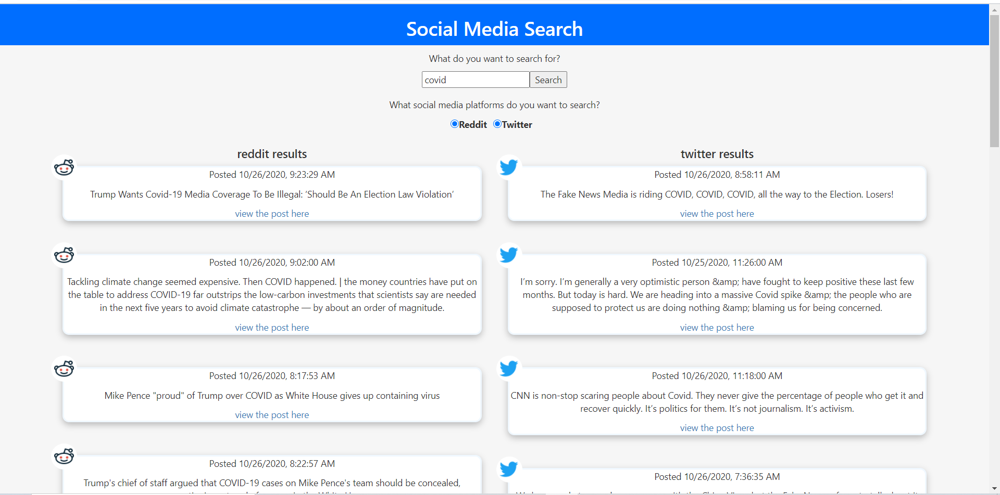

Simple web app that uses APIs of multiple social media sites to search for a given string

Backend created using express, frontend created using create-react-app

Uses nodemon in dev to restart the server when changes are made 

In order for this app to work (if you were to clone the repo, install the dependencies, and run the api and client) you'll need to create a `config.js` file in the `api` directory that exports an object that has credentials such as reddit username, reddit password, reddit app id, reddit app secret, twitter consumer key, and twitter consumer secret)

After cloning the repo and creating the `config.js` file, to run the app, navigate to the `api` folder in terminal and run `npm start`. Then navigate to the `client` folder and run `npm start`. The app should start up and be available in your web browser at http://localhost:3000/.

----------
TODO
- add instagram search
- add FB search
- add tests to front-end components
- add tests to back-end logic
- add better error handling on failed http requests
----------

